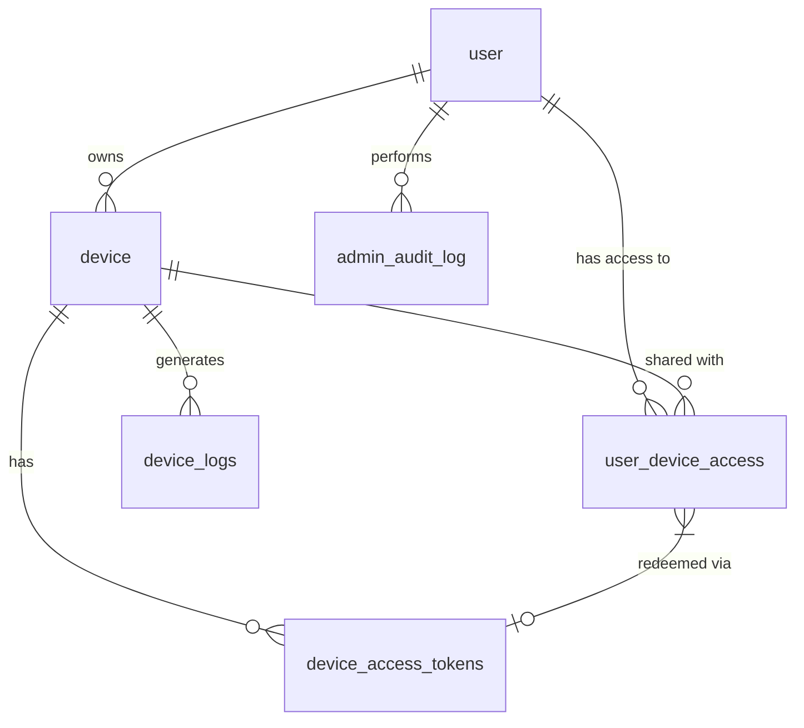

# Design Document: Admin Panel, User Access Control & Device Sharing

## Overview
This feature transforms the UnimonMQ dashboard from a single-user ownership model to a multi-role, multi-user-per-device architecture. It introduces an Admin Panel for system-wide management, a token-based device sharing system, and enhanced logging for incubator devices to detect and record significant changes (spikes).

## Architecture

The system follows a typical 3-tier architecture:
1.  **Frontend (UI):** PHP-based web pages using Tailwind CSS for styling and MQTT.js for real-time interaction.
2.  **Backend (Logic):** PHP for web requests and a Node.js MQTT background worker for data processing and logging.
3.  **Database:** MySQL/MariaDB for persistent storage.

### New Components
-   **Admin Panel:** A restricted area for users with the `admin` role to manage all users and devices.
-   **Token Service:** Logic to generate, validate, and redeem device access tokens.
-   **Access Control Middleware:** Logic to check user permissions (Admin/Owner/Viewer) on various pages and actions.
-   **Spike Detection Engine:** Logic within the MQTT worker to detect and log significant changes in sensor data.

## Data Models

### Database Schema Changes

#### 1. Table `user` (Update)
-   Add `role` ENUM('admin', 'user') DEFAULT 'user'.

#### 2. Table `device` (Update)
-   Add `last_logged_values` JSON NULL (stores last logged temperature/humidity).

#### 3. Table `device_logs` (Update)
-   Add `log_type` ENUM('aggregation', 'change_event') DEFAULT 'aggregation'.

#### 4. Table `device_access_tokens` (New)
-   `token_id` INT AUTO_INCREMENT PK
-   `device_id` INT (FK to `device.device_id`)
-   `token_code` VARCHAR(50) UNIQUE
-   `created_by` INT (FK to `user.user_id`)
-   `max_uses` INT NULL
-   `current_uses` INT DEFAULT 0
-   `expires_at` DATETIME NULL
-   `is_active` BOOLEAN DEFAULT TRUE
-   `created_at` TIMESTAMP DEFAULT CURRENT_TIMESTAMP

#### 5. Table `user_device_access` (New)
-   `id` INT AUTO_INCREMENT PK
-   `user_id` INT (FK to `user.user_id`)
-   `device_id` INT (FK to `device.device_id`)
-   `access_type` ENUM('owner', 'viewer')
-   `redeemed_via_token_id` INT NULL (FK to `device_access_tokens.token_id`)
-   `granted_at` TIMESTAMP DEFAULT CURRENT_TIMESTAMP
-   UNIQUE KEY `user_device` (`user_id`, `device_id`)

#### 6. Table `admin_audit_log` (New)
-   `log_id` INT AUTO_INCREMENT PK
-   `admin_id` INT (FK to `user.user_id`)
-   `action` VARCHAR(255)
-   `target_type` VARCHAR(50) (e.g., 'user', 'device', 'token')
-   `target_id` INT
-   `details` JSON
-   `created_at` TIMESTAMP DEFAULT CURRENT_TIMESTAMP

## Components and Interfaces

### 1. Admin Panel (`admin/index.php`)
-   Excel-like tables for Users and Devices.
-   **Users Tab:** Display all users, their roles, and device counts. Actions: Edit Role, Delete User.
-   **Devices Tab:** Display all devices, types, owners, and assigned users. Actions: Edit Device, Delete Device, Manage Tokens.

### 2. Device Sharing UI
-   **Token Generation Modal:** In Admin Panel, allows admins to create a token with optional expiry and usage limits.
-   **Redeem Token UI:** In User Dashboard, a button and modal to enter a token code.

### 3. Dashboard Updates (`dashboard.php`)
-   Query logic updated to: `SELECT devices OWNED BY user OR devices SHARED WITH user`.
-   Visual badges: "OWNER" vs "SHARED".

### 4. Device Access Logic
-   **Incubator Dashboard:** Checks if the current user has a record in `user_device_access` for the `device_id` OR is the `device.user_id` (owner).
-   **Restrictions:** If `access_type == 'viewer'`, the MQTT publish functionality (target temperature/humidity) and configuration editing should be disabled/hidden.

### 5. MQTT Worker: Spike Detection
-   Modify `handleIncubator` in `mqtt-worker/src/handlers/incubator.js`:
    1.  Read `last_logged_values` from the `device` record.
    2.  Compare incoming `temperature` and `humidity` with `last_logged_values`.
    3.  If Δ >= 1.0, insert a `change_event` log into `device_logs`.
    4.  Update `last_logged_values` in the `device` table.

## Error Handling
-   **Access Denied:** Redirect to dashboard with a flash message if a non-admin tries to access admin pages.
-   **Invalid Token:** Display specific error messages (Expired, Max Uses Reached, Not Found).
-   **Concurrent Redemption:** Use database transactions when redeeming tokens to ensure `current_uses` does not exceed `max_uses`.

## Testing Strategy
-   **Unit Tests:** For token generation and validation logic.
-   **Integration Tests:**
    -   Admin role assignment and page protection.
    -   Token redemption flow (success, expired, used).
    -   Many-to-many relationship (multiple users seeing the same device).
-   **Manual Verification:**
    -   Simulate sensor spikes and verify `device_logs` entries.
    -   Verify visual badges on the dashboard.
    -   Verify restriction of edit/publish actions for viewers.

## Diagrams (Mermaid)

